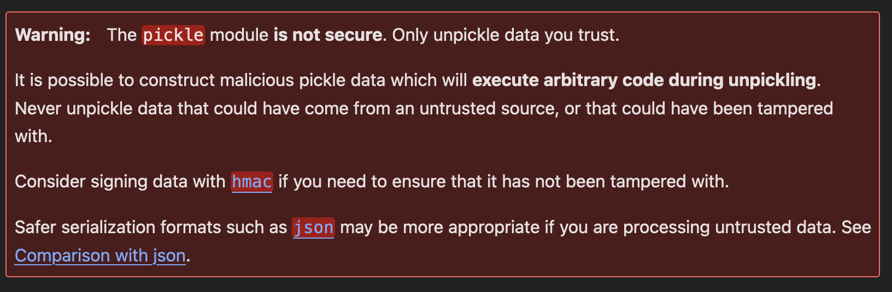
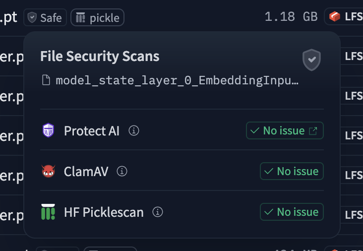
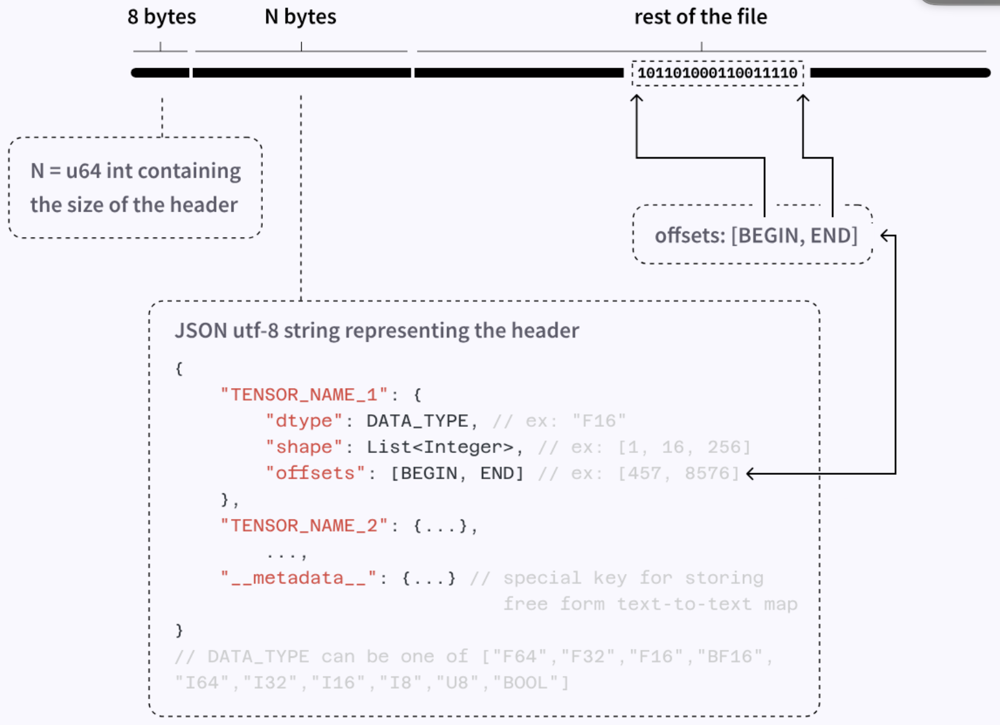

---
# You can also start simply with 'default'
theme: seriph
# random image from a curated Unsplash collection by Anthony
# like them? see https://unsplash.com/collections/94734566/slidev
# some information about your slides (markdown enabled)
title: "The Trouble with Tensors: Securing Tensor Serialization"
info: |
  ## The Trouble with Tensors: Securing Tensor Serialization
  How pickle makes unknown Tensors dangerous
# apply unocss classes to the current slide
class: text-center
# https://sli.dev/features/drawing
drawings:
  persist: false
# slide transition: https://sli.dev/guide/animations.html#slide-transitions
transition: slide-left
# enable MDC Syntax: https://sli.dev/features/mdc
mdc: true
---

# The Trouble with Tensors
# Securing Tensor Serialization
  How pickle makes unknown Tensors dangerous

<!--
Struktur:
Zeigen wie man mit torch tensors saved
Eingehen auf pickle (Pickle VM)
How can we fix it?
Safetensors
Additional https://huggingface.co/docs/safetensors/en/speed
https://github.com/pytorch/pytorch/blob/main/SECURITY.md#untrusted-models
https://huggingface.co/docs/hub/en/security-protectai
https://github.com/trailofbits/fickling
https://hiddenlayer.com/innovation-hub/weaponizing-machine-learning-models-with-ransomware/#Exploiting-Serialization
Future Warning since Pytorch 2.4 (End of July 2024 )
-->

---
transition: slide-left
---

# Loading and Saving Torch Tensors is Easy
Let's see an exampple
```python {all|3-4|7-8}
import torch

tensor = torch.tensor([1, 2, 3, 4, 5])
torch.save(tensor, 'tensor.pt')


loaded_tensor = torch.load('tensor.pt', weights_only=False)
assert loaded_tensor == tensor

```
But is it secure?


<!--
You can have `style` tag in markdown to override the style for the current page.
Learn more: https://sli.dev/features/slide-scope-style
-->

<!--
Here is another comment.
-->

---
transition: slide-left
level: 2
---

# `torch.load`, `torch.save` is based on Python Pickles
Let's look into the docs!



Ok but why??


<!--
Foo Bar
-->

---
transition: slide-left
---

# Pickles are their own little Program
Let's consider following program

```python{all|1-2|4|6-7|all}
import pickle
import pickletools

my_data=("foo","bar",42)

my_pickle = pickle.dumps(my_data,protocol=0)
print(pickletools.dis(my_pickle))
```

Outputs the following:
```bash{all|1|2-3|4-5|6|1-7|all}
    0: (    MARK
    1: V        UNICODE    'foo'
    6: p        PUT        0
    9: V        UNICODE    'bar'
   14: p        PUT        1
   17: I        INT        42
   21: t        TUPLE      (MARK at 0)
   22: p    PUT        2
   25: .    STOP
highest protocol among opcodes = 0
```
<!--
    You can i
    I(name='TUPLE',
      doc="""Build a tuple out of the topmost stack slice, after markobject.

      All the stack entries following the topmost markobject are placed into
      a single Python tuple, which single tuple object replaces all of the
      stack from the topmost markobject onward.  For example,

      Stack before: ... markobject 1 2 3 'abc'
      Stack after:  ... (1, 2, 3, 'abc')
      """),
-->


---
transition: slide-left
---

# How to craft a malicious pickle
Let's consider following program

```python {0|1|2-6|8-11|13-14|all}
import torch

tensor = torch.tensor([1, 2, 3, 4, 5])
torch.save(tensor, 'good_pickle.pt', _use_new_zipfile_serialization=False)
with open('good_pickle.pt', 'rb') as f:
    good_pickle = f.read()

pickled_bomb = b'c__builtin__\neval\n(Vprint("Hello from Gregor")\ntR0'
evil_pickle = pickled_bomb + good_pickle
with open("evil_pickle.pt","wb") as f:
    f.write(evil_pickle)

result_tensor = torch.load("evil_pickle.pt", weights_only=False)
assert all(tensor == result_tensor)
```

Outputs:
```bash {0|all}
Hello from Gregor

Process finished with exit code 0
```
<!--
    What happend? Let's take a look at the Pickle Bytecode to get a better understanding
-->

---
transition: slide-left
---

# Disassemble our malicious pickle
Let's consider following script
```python {0|all}
import pickletools
print(pickletools.dis(evil_pickle))
```

Outputs:
```bash {0|1|2|3|2-4|5|1-5|6|7-8|9}
    0: c    GLOBAL     '__builtin__ eval'
   18: (    MARK
   19: V        UNICODE    'print("Hello from Gregor")'
   47: t        TUPLE      (MARK at 18)
   48: R    REDUCE
   49: 0    POP
   50: \x80 PROTO      2
   52: \x8a LONG1      119547037146038801333356
   64: .    STOP
highest protocol among opcodes = 2
```

<!--
       I(name='GLOBAL',
      doc="""Push a global object (module.attr) on the stack.

      Two newline-terminated strings follow the GLOBAL opcode.  The first is
      taken as a module name, and the second as a class name.  The class
      object module.class is pushed on the stack.  More accurately, the
      object returned by self.find_class(module, class) is pushed on the
      stack, so unpickling subclasses can override this form of lookup.
      """),
-->

---
class: text-center
transition: slide-left
layout: center
# mdc: true
---

# Mitigations
  What can we do?

---
transition: slide-left
layout: two-cols
---

# Option 1: Security Scan Tensor Files

Multiple Security Scanners are available:
- fickle
- ScanAV
- Protect AI
- HF Pickle Scan
- ...

This will never be 100% foolproof

::right::



<!--
Basically works by checking against a list of unsafe imports during unpickling. But what this never is a foolproof way. The attack vector is gigantic.
-->

---
transition: slide-left
---

# Option 2: Use `weights_only=True`

```python
result_tensor = torch.load("evil_pickle.pt", weights_only=True)
assert all(tensor == result_tensor)
```

Outputs:
```bash
_pickle.UnpicklingError: Weights only load failed. This file can still be loaded, to do so you have two options, do those steps only if you trust the source of the checkpoint. 
	(1) Re-running `torch.load` with `weights_only` set to `False` will likely succeed, but it can result in arbitrary code execution. Do it only if you got the file from a trusted source.
	(2) Alternatively, to load with `weights_only=True` please check the recommended steps in the following error message.
	WeightsUnpickler error: Unsupported global: GLOBAL __builtin__.eval was not an allowed global by default. Please use `torch.serialization.add_safe_globals([eval])` to allowlist this global if you trust this class/function.

Check the documentation of torch.load to learn more about types accepted by default with weights_only https://pytorch.org/docs/stable/generated/torch.load.html.
```
<!--
Future Warning since Pytorch 2.4 (End of July 2024 )
  Starting in version 2.6, torch.load will use weights_only=True if the pickle_module argument is not passed.

As discussed in the documentation for torch.load(), weights_only=True restricts the unpickler used in torch.load to only executing functions/building classes required for state_dicts of plain torch.Tensors as well as some other primitive types. Further, unlike the default Unpickler provided by the pickle module, the weights_only Unpickler is not allowed to dynamically import anything during unpickling.
-->


---
transition: slide-left
level: 2
---

# Option 3: Use a Different Data Format
Huggingface has you covered with Safetensors!

<div class="flex justify-center items-center">
  
</div>

---
transition: slide-left
level: 2
---

# Option 3: Use a Different Data Format
Advantages of Safetensors
- Stupid Simple Dataformat
- Faster than pickle (Pytorch)
- Zero Copy
- Secure (significantly smaller attack vector than `torch.load`)


<!--
GPU: 2x faster (loading GPT2 on Tesla T4)
CPU: 70x faster (loading GPT2)
Zero Copy: requires only as much memory while loading as the filesize
-->

---
transition: slide-left
level: 2
---

# Option 3: Use a Different Data Format
It's so simple we can even write our own parser


<div style="max-height: 45vh; overflow-y: auto; border: 1px solid #ccc; padding: 10px;">

```python{all|1-4|6-10|12|13-15|16|17-18|20|21-22|16,23-26|27|28|29-32|33,12|35-36}
import struct
import torch
import json
from safetensors.torch import save_file

tensors = {
    "embedding": torch.rand((2,2), dtype=torch.float32),
    "attention": torch.rand((2,3), dtype=torch.float32),
}
save_file(tensors, "model.safetensors")

output = {}
with open("model.safetensors", "rb") as f:
    header_length_bytes = f.read(8)
    header_length = struct.unpack("<Q", header_length_bytes)[0]
    start_of_data= 8 + header_length
    header_string = f.read(header_length).decode('utf-8')
    header = json.loads(header_string)

    for name, tensor_information in header.items():
        if tensor_information["dtype"] != "F32":
            raise ValueError("Tensor {} not supported".format(name))
        shape = tensor_information["shape"]
        start, end = tensor_information["data_offsets"]
        end += start_of_data
        start += start_of_data
        f.seek(start)
        data = []
        while f.tell() < end:
            f32_bytes = f.read(4)
            f32 = struct.unpack("f", f32_bytes)[0]
            data.append(f32)
        output[name] = torch.tensor(data).reshape(tensor_information["shape"])

    for name, tensor in tensors.items():
        assert torch.equal(output[name], tensor)
```
</div>

<!--
    "<": Indicates little-endian byte order. Little-endian means the least significant byte is stored first.
    "Q": Stands for an unsigned long long integer, which is typically 8 bytes (64 bits) in size.

-->

---
transition: slide-left
level: 2
---

# Summary
What did we learn?

- only unpickle/`torch.load` data you trust
- using `torch.load` can lead to RCE
- do not fully trust on Security Scans
- use SafeTensors wherever possible


